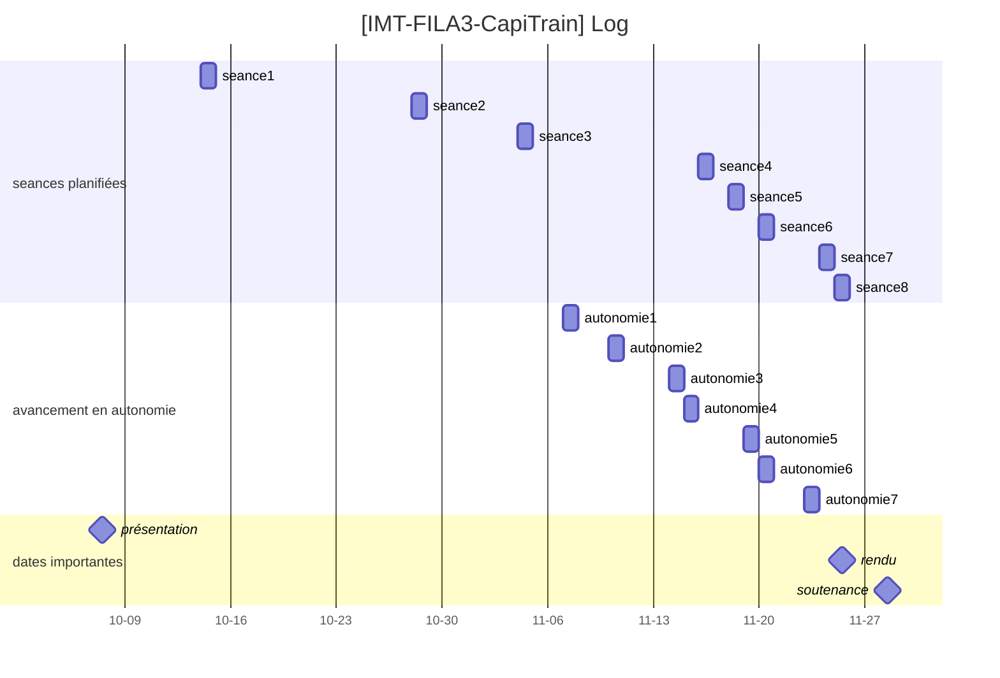

# Programmation en Java d’interprètes pour un sous ensemble de Java 8

- Auteurs : JALLAIS Adrien & SIMON Géraud
- Promotion : IMT FIL 2023 - 3ème année
- Date de rendu : 25/11/2022

Sommaire :

- 1. [Introduction](#Introduction)
- 2. [Comment le code est-il organisé ?](#Commentlecodeest-ilorganis)
- 3. [Comment le code peut-il être lancé ?](#Commentlecodepeut-iltrelanc)
- 4. [Quelles méthodes en Haskell, ont été converties en Java ?](#QuellesmthodesenHaskellonttconvertiesenJava)
- 5. [Quelles méthodes en Haskell, reste-il à convertir en Java ?](#QuellesmthodesenHaskellreste-ilconvertirenJava)
- 6. [Quels sont les points forts et faibles de notre interprète en Java](#QuelssontlespointsfortsetfaiblesdenotreinterprteenJava)
  - 6.1. [Points forts](#Pointsforts)
    - 6.1.1. [Patron _Singleton_ pour la $CT$](#Patron_Singleton_pourlaCT)
    - 6.1.2. [_TDeclaration_ et _T_](#TDeclaration_et_T_)
    - 6.1.3. [`Set` représentant les séquences](#Setreprsentantlessquences)
  - 6.2. [Points faibles](#Pointsfaibles)
- 7. [Choix réalisés](#Choixraliss)
  - 7.1. [Structures de représentation des séquences](#Structuresdereprsentationdessquences)
    - 7.1.1. [options 1 : utilisation du type `List`](#options1:utilisationdutypeList)
    - 7.1.2. [option 2 : utilisation du type `Set`](#option2:utilisationdutypeSet)
    - 7.1.3. [Conlusion](#Conlusion)
- 8. [[Fichier de notes](https://pad.faire-ecole.org/s/QrN2T4Tq\_#)](#Fichierdenoteshttps:pad.faire-ecole.orgsQrN2T4Tq_)
  - 8.1. [Lexique](#Lexique)
    - 8.1.1. [concepts java](#conceptsjava)
    - 8.1.2. [concepts mathématiques](#conceptsmathmatiques)
    - 8.1.3. [concepts logiques](#conceptslogiques)
    - 8.1.4. [méthodes utilisées](#mthodesutilises)
  - 8.2. [Règles](#Rgles)
    - 8.2.1. [Règles de type](#Rglesdetype)
  - 8.3. [Java vs FJ](#JavavsFJ)
- 9. [Fichier de log](#Fichierdelog)
- 10. [Interprétations du code Haskell](#InterprtationsducodeHaskell)

## 1. Introduction

Dans le cadre d'une unité d'ensignement d'initiation à la recherche, Rémi Douence a proposé de s'intéresser à une définition rigoureuse des expressions lambdas intégrées par Java 8, avec le papier suivant : [Property-based Testing for Lambda-Expressions Semantics in Featherweight Java. (S. da Silva Feitosa,2018)](https://doi.org/10.1145/3264637.3264643). Dans cet article, les auteurs formalisent cette nouvelle fonctionnalité en utilisant des interprètes en Haskell, dont le code est accessible au répertoire suivant : [fj-lam](https://github.com/fjpub/fj-lam).

L'objectif de ce projet est de convertir ces interprètes en Java et de démontrer le bon fonctionnement de nos interprètes en Java.

# Description du code

Pour faciliter la compréhension globale du code, un [diagramme de classe a été réalisé](https://github.com/Naedri/java-interpreter/blob/main/diagram/java-interpreter-class-diagram.png) :

## 2. Comment le code est-il organisé ?

Le code de ce projet est organisé de la manière suivante :

- Les différentes structures de données de `FJParser.hs` ont été répartis dans le package `src.Parser.DefinitionP`, sauf pour `Expr` et `TypeError`.
- Les expressions (`Expr`) ont été regroupées dans le package `src.Parser.ExpressionP` et héritent toutes de la classe abstraire java : `Expr`.
- Les différents types d'erreurs (`TypeError`) ont été regroupées dans le package `src.Parser.TypingErrorP`.
- Le package `src.Utils` contient la classe `FJUtils`, avec les méthodes générales d'évaluation.
- Notre traduction de l'approche V1 ne comprend à l'heure actuelle que la traduction de `FJInterpreter.hs`. Celle-ci est disponible dans le package `src.V1`
  - Remarque : Pour `FJInterpreter.java`, les méthodes `evalPrime()` et `subst()` sont accompagnées de "sous-méthodes" correspondantes au _pattern matching_ disponible en Haskell selon les types de paramètres (ex: `eval' ct (CreateObject c p)` est traduit en Java par la méthode `evalPrime()` qui va appeler `evalPrimeAsCreateObject()`).

## 3. Comment le code peut-il être lancé ?

Le code de ce projet peut être exécuté en utilisant la fonction `main` du fichier `./src/main.java`.
Sous Eclipse, ce projet peut être importé après avoir dezippé le dossier obtenu depuis github, puis après avoir réalisé les actions suivantes : `File` > `Import` > `General` > `Import` > `Existing Projects into Workspace` > `Select root directory` en sélectionnant comme racine le contenu du dossier décompressé > `Finish`.

# Résultats

## 4. Quelles méthodes en Haskell, ont été converties en Java ?

| Méthodes                       | Première implémentation | Testée                        |
| ------------------------------ | ----------------------- | ----------------------------- |
| **`FJParser`**                 |                         |                               |
| `T.TClass`                     | :white_check_mark:      | :white_check_mark:            |
| `T.TInterface`                 | :white_check_mark:      | :white_check_mark:            |
| `Class`                        | :white_check_mark:      | :white_check_mark:            |
| `Interface`                    | :white_check_mark:      | :negative_squared_cross_mark: |
| `Method`                       | :white_check_mark:      | :white_check_mark:            |
| `Expr.Var`                     | :white_check_mark:      | :white_check_mark:            |
| `Expr.FieldAccess`             | :white_check_mark:      | :white_check_mark:            |
| `Expr.MethodInvk`              | :white_check_mark:      | :negative_squared_cross_mark: |
| `Expr.CreateObject`            | :white_check_mark:      | :white_check_mark:            |
| `Expr.Cast`                    | :white_check_mark:      | :negative_squared_cross_mark: |
| `Expr.Closure`                 | :white_check_mark:      | :negative_squared_cross_mark: |
| `Type`                         | :white_check_mark:      | :white_check_mark:            |
| `Env`                          | :white_check_mark:      | :negative_squared_cross_mark: |
| `CT`                           | :white_check_mark:      | :white_check_mark:            |
| `TypeError.VariableNotFound`   | :white_check_mark:      | :negative_squared_cross_mark: |
| `TypeError.FieldNotFound`      | :white_check_mark:      | :negative_squared_cross_mark: |
| `TypeError.ClassNotFound`      | :white_check_mark:      | :negative_squared_cross_mark: |
| `TypeError.MethodNotFound`     | :white_check_mark:      | :negative_squared_cross_mark: |
| `TypeError.ParamsTypeMismatch` | :white_check_mark:      | :negative_squared_cross_mark: |
| `TypeError.WrongClosure`       | :white_check_mark:      | :negative_squared_cross_mark: |
| `TypeError.WrongCast`          | :white_check_mark:      | :negative_squared_cross_mark: |
| `TypeError.UnknownError`       | :white_check_mark:      | :negative_squared_cross_mark: |
| **`FJUtils`**                  |                         |                               |
| `subtyping`                    | :white_check_mark:      | :negative_squared_cross_mark: |
| `fields`                       | :white_check_mark:      | :negative_squared_cross_mark: |
| `methods`                      | :white_check_mark:      | :negative_squared_cross_mark: |
| `mbody`                        | :white_check_mark:      | :negative_squared_cross_mark: |
| `isValue`                      | :white_check_mark:      | :negative_squared_cross_mark: |
| **`FJInterpreter`**            |                         |                               |
| `eval'`                        | :white_check_mark:      | :negative_squared_cross_mark: |
| `eval`                         | :white_check_mark:      | :negative_squared_cross_mark: |
| `subst`                        | :white_check_mark:      | :negative_squared_cross_mark: |

Les tests qui ont pu être réalisés se résument à s'assurer que les objets créés par l'instanciation de la classe `C` (correspondant au _type definition_). Ces instanciations ont permis des tester l'ensemble des classes du package `src.Parser.DefintionP`.

## 5. Quelles méthodes en Haskell, reste-il à convertir en Java ?

|                           |                      |                        |
| ------------------------- | -------------------- | ---------------------- |
| **`FJUtils`**             |                      |                        |
| `absmethods`              | `mtype`              | `lambdaMark`           |
| `removeRuntimeAnnotation` |                      |                        |
| **`FJTypeChecker`**       |                      |                        |
| `throwError`              | `typeof`             | `methodTyping`         |
| `classTyping`             | `interfaceTyping`    | `ctTyping`             |
| **`FJGenerator`**         |                      |                        |
| `maybeElements`           | `pickVar`            | `genClassName`         |
| `genInstantiableType`     | `genClassType`       | `genInterfaceTypeList` |
| `genVar`                  | `genAttrs`           | `genMethod`            |
| `genSign`                 | `genMethods`         | `genClass`             |
| `genInterface`            | `addClass`           | `addInterface`         |
| `addType`                 | `genClassTable`      | `genCreateObject`      |
| `genFieldAccess`          | `genMethodInvk`      | `genCast`              |
| `genClosure`              | `ccreateobject`      | `cfieldaccess`         |
| `cmethodinvk`             | `cucast`             | `cdcast`               |
| `cscast`                  | `cclosure`           | `genExpr`              |
| `genExpression`           | `instance Arbitrary` |                        |

# Discussion

## 6. Quels sont les points forts et faibles de notre interprète en Java

### 6.1. Points forts

#### 6.1.1. Patron _Singleton_ pour la $CT$

Il n'est possible d'instancier qu'une seule fois la classe `CT` (_class table_ $CT$) car cette classe a été implémentée en suivant le patron _Singleton_.
En effet, la _class table_ sert de "dictionnaire" en recensant toutes les classes et méthodes du programme évalué, et est donc universel au programme et doit, pour des soucis d'homogénéité être unique.

#### 6.1.2. _TDeclaration_ et _T_

Les types correspondants à des Interfaces (`src.Parser.DefinitionP.I`) ou des Classes (`src.Parser.DefinitionP.C`) étendent tous les deux le type $T$, ce qui permet de prévoir une factorisation de code. Par exemple avec le mot clé `extends` commun aux interfaces et aux classes.
Il est prévu également une autre factorisation de code pour la déclaration du corps des classes et des interfaces qui comportent toutes deux des méthodes.

#### 6.1.3. `Set` représentant les séquences

Pour réprésenter des séquences (ex. $\overline{T}$), nous avons utilisés des `TreeSet` pour se protéger des duplications des données, tout en gardant une structure de données itérable.
Cela est particulièrement utile pour les séquences d'interfaces ($\overline{I}$) qui définissent les interfaces implémentées ou étendues. En effet, la duplication de nom d'interfaces dans une même liste d'implémentation en Java n'est pas autorisée. De plus les auteurs utilisant le terme de _sequence_ font selon nous référence à la notion d'ensemble qui selon nous est constitué d'éléments uniques.
Nous donnons plus de détails sur ce choix dans la partie _Choix réalisés_.

### 6.2. Points faibles

Seule l'approche V1 a pu être explorée et traduite dans notre projet, faute de temps.

Par ailleurs, nous n'avons pas pu traduire l'ensemble des méthodes de la V1 vers le Java.

De plus, certaines des méthodes qui ont pu être implémentées n'ont pas pu être toutes testées et optimisées (i.e temps d'exécution et de ressources consommées (nombre d'appels entre les objets, redondances des boucles...)).

## 7. Choix réalisés

Comme le montre les points suivants, plusieurs choix on pu être réalisés lors de l'implémentation des interpréteurs.

- Emballer variables de type String dans des classes (ex. `TypeName` dans la classe `Type`).
- Utilisation de structures de représentation des séquences (ex. `Set` à la place de `List` ou `Array`).

Dans la partie suivante nous discuterons de ce dernier choix.

### 7.1. Structures de représentation des séquences

Dans l'article les auteurs utilisent des séquences ($\overline{T} \overline{I} \overline{M}$)
Dans l'implémentation, ces séquences ont été stockées dans des structures de données. Dans chaque cas, nous avons d'abord vérifié si l'objet lié allait être modifié ou non, et si nous avions besoins de tableaux, de listes ou de collections.
Ce point du rapport va discuter notre choix entre l'utilisation du type `List` ou du type `Set`.

#### 7.1.1. options 1 : utilisation du type `List`

##### Avantages

- limite la possibilité d'un `ArrayOutOfBound`
- facilite le parcours des données
- maintient l'ordre d'insertion

##### Inconvénients

- pas de comparaisons entre les données
- pas de protection contre les doublons (il aurait pu être possible de le faire manuellement en redéfinissant des `equals()` à chaque type d'`Expr`, mais cela aurait été fastidieux et source d'erreurs potentielles)

#### 7.1.2. option 2 : utilisation du type `Set`

##### Avantages

- protection contre les doublons
- le type `Set` n'autorise qu'une seule valeur nulle dans la collection. Comme le code (cf. `FJUtils` et `FJInterpreter`) contient déjà des contrôles pour éviter qu'un null soit inséré dans une collection, cette caractéristique de structure donnée était adéquate à notre utilisation

##### Inconvénients

- moins adapté pour les parcours que le type `List`
- nécessite un temps de travail supplémentaire pour la définition de l'implémentation de l'interface `Comparable`

#### 7.1.3. Conlusion

Notre première version du projet utilisait des **tableaux** pour les structures de données (ex. en attribut de la classe `Signature.java`, on avait `Field[] params`).
Ce choix avait été pris pour les cas où nous étions sûrs que les données étaient définies, et donc que la taille du tableau serait fixe.

La seconde version du projet utilisait des **listes** (`List` puis `ArrayList`).
L'objectif principal était de limiter la possiblité d'un `ArrayOutOfBound` (dépassement de la taille du tableau quand on le parcourt ou quand on y ajoute un nouvel élément). Ensuite, les listes permettaient une navigation plus simple dans les parcours, comme dans les boucles `for`, avec plus de flexibilité que les tableaux.
Une première implémentation était l'utilisation du type `List<>` dans les signatures des méthodes, puis dans l'implémentation un `ArrayList<>`. Cela offre un code plus sûr et plus adapté aux pratiques professionnelles. Cependant, pour simplifier temporairement le code, nous sommes passés à utiliser `ArrayList<>` à chaque occurence.
Nous avions le choix entre `ArrayList` et `LinkedList` :

- `ArrayList` reproduit une structure sous forme de tableau (basée sur l'index d'un élément) et permet de faciliter les get(), ce qui nous semblait le plus pertinent à cette phase du projet.
- `LinkedList` lie les objets de la liste entre eux, ce qui fait que pour récupérer un élément précis, il faut parcourir chaque élément de la liste pour le trouver. Nous avons conclu que l'`ArrayList` était plus pertinent pour optimiser les accès aux éléments de la liste.

La troisième et actuelle version utilise des **sets** (`TreeSet`).
L'objectif était de protéger nos séquences en évitant d'y insérer des doublons.

- Nous avons fait le choix du format `TreeSet` pour garder en mémoire l'ordre d'insertion des objets, et pouvoir utiliser des index sur la structure de données. Ce cas à notamment était nécessaire lors de l'implémentation de la méthode `eval'` dans le cas des `FieldAcess`, où on utilise `Data.List.findIndex` pour récupérer l'index d'un élément, puis retourner l'élément lié à cet index.

# Rétrospectives

Dans le cas où nous devrions refaire ce projet d'initiation à la recherche, nous aurions demandé quelle était la priorité entre finir la compréhension de l'article ou bien l'implémentation des interprètes en Java.

Dans notre cas, nous avons accordé beaucoup de temps lors de nos premières séances à la lecture de l'article, ce qui nous a empêché de nous intéresser au code en Haskell et de commencer à coder, ce qui pourrait expliquer une v1 non terminé.

Si nous avions à recommencer, nous aurions une courbe d'apprentissage sur la compréhension d'Haskell moins longue.

# Annexes

## 8. [Fichier de notes](https://pad.faire-ecole.org/s/QrN2T4Tq_#)

### 8.1. Lexique

#### 8.1.1. concepts java

- `functional interface` : interface possédant une et une seule méthode abstraite (dont seule la signature est indiquée)
- `abstract method`: une méthode sans implémentation
- `default method` : une méthode déclarée dans une interface, et qui possède une implémentation par défault
- $\lambda$`-expression` / $\lambda$`-fonction`: fonction anonyme qui implémente une interface fonctionnelle mais qui est écrit sans type.
  - Elles ne peuvent cependant être appelées sans type
  - Elles permettent au programme de traiter les fonctions comme l'argument de méthode
- `Object`: Base class of every class, which has no fields (so the invocations of super have no arguments) and no methods
- `target type` : type d'une $\lambda$`-expression` inféré par le compilateur en fonction du contexte de celle-ci. Ce type est nécessaire pour que la $\lambda$`-expression` puisse être invoquée
- `type elaboration` : la tâche de construire une représentation explicitement typée du programme
- `type inference` : le problème de déterminer si un programme est bien typé
- `type soudness` : le système de types de Java est sain (_sound_), dans le sens où, à moins qu'une exception ne soit levée, l'évaluation de toute expression produira une valeur d'un type "compatible" avec le type qui lui est attribué par le système de types (cf. [ref](https://link.springer.com/chapter/10.1007/3-540-48737-9_2))
- `type judgement` : jugement du type d'une expression (représenté par $\leadsto$)
  - quand le `type judgement` est appliqué sur une expression $e$, il produit un couple : $\langle T , e'\rangle$, avec $T$ le type de cast et $e'$ une nouvelle expression
- `cast` : $\Gamma \vdash e : \langle T, e' \rangle$ <=> soit une expression $e$ composée d'une expression $e'$ annotée par le type $T$ / castée en $T$
- `params` vs. `args`: on définit les paramètres d'une fonction, qu'on appelle en lui passant des arguments

#### 8.1.2. concepts mathématiques

- $x : T$ : on associe à la variable $x$ un type $T$
- $\overline{x}$ : séquence possiblement vide de $x$
- $\bullet$ : séquence vide <=> `[]`
- $\sharp \overline{x}$ : taille de la séquence de $x$
- $\langle \rangle$ : couple dont l'ordre est à prendre en compte (à la différence d'une paire)
- $( \overline{T} \overline{x} )$ : séquence de paramètre $x$ qui sont de type $T$
- $T <: U$ ou $T <: \overline{U}$ : $T$ est sous type de $U$ ou de toutes les occurences de $\overline{U}$ respectivement
- $( \overline{T} \overline{x} ) \rightarrow e$ : définition formelle d'une fonction anonyme (d'une $\lambda$`-expression`) de $\sharp x$ paramètres, dont le corps est défini par l'expression $e$
- $\Gamma$ : représente un mapping fini : $\overline{x}:\overline{T}$, reliant les variables $x$ (leur nom) à leur type $T$ => définir le contexte/environnement
  - $\Gamma \vdash E : T$ : "Dans le context $\Gamma$, l'expression $E$ est de type $T$"
- $CT$ : représente une table qui associe le noms des interfaces ou des classes à leur déclaration ($L$ ou $P$) => mémoriser le programme source

#### 8.1.3. concepts logiques

- séquent : conjonction d'hypothèses $\vdash$ disjonction de conclusion
- règles : $\frac{premises}{conclusion}$ de séquent

##### [exemple](https://www.everything2.org/index.pl?node=Judgment)

$\frac{ \Gamma , x : T1 \vdash E : T2 }{ \Gamma \vdash (\lambda x : T1 . E) : T1 \rightarrow T2 }$

qui dit que nous pouvons conclure que $ (\lambda x : T1 . E)$ a le type $T1 \rightarrow T2$ (c'est-à-dire que c'est une fonction de valeurs de type T1 vers des valeurs de type T2) dans le contexte $\Gamma$, à condition que dans le contexte étendu où nous portons l'hypothèse supplémentaire que x a le type T1, nous puissions montrer que E a le type T2.

#### 8.1.4. méthodes utilisées

- `mtype` : permet d'obtenir le type d'une méthode m dans une classe C, en renvoyant une paire de `[liste de Type, Type]` <=> `types de paramètres de la méthode et le type de rentour de la méthode`
- `mbody` : permet d'obtenir une paire de `(liste de String, Expr)` <=> `liste des paramètres, expression`
- $\lambda$`mark` : fonction qui ajoute, lors du _run-time_, une définition de `cast` si et seulement si la $\lambda$`-expression` apparaît dans le code source
- `fields` : fonction qui renvoie une liste `(Type, String)` <=> `liste composée du tpye et du nom de chaque attributs`

### 8.2. Règles

#### 8.2.1. Règles de type

##### Expression typing : `T-Var`

Si dans notre environnement, on a une variable $x$ de type $T$ ;

Alors son type peut être jugé tel que $x \leadsto \langle T , x \rangle $.

Autrement dit, son type la variable $x$ peut-être annotée du type $T$ / castée en type $T$.

##### Expression typing : `T-Field`

Si dans notre environnement, il existe une expression $e_0$, tel que le jugement de type permet un cast en une expression $e_0$ de type classe $C_0$
(s'il existe une expression $e_0$ associée à $e_0'$ annotée du type $C_0$),
et si l'on définit les attributs de la classe $C_0$ par $\overline{T} \overline{f}$ ;

Alors le type d'un attribut $f_i$ de $e$ peut être jugé tel que $xleadsto \langle T , x \rangle $.

Autrement dit, si l'on peut caster une classe $A$ vers une autre classe $B$, alors on peut inférer ses attributs en utilisant le type des attributs de la classe $B$.

##### Expression typing : `T-Invk`

Si l'on définit une méthode `mtype`prenant en paramètre le nom d'une méthode ($m$) et la classe/interface associée ($T_0$), et qui renvoie la liste des types de ses paramètres associée $\overline{U}$ son type de retour $T$,
et si dans notre environnement, il existe une expression $e_0$, que l'on peut caster en $e_0'$ en l'annotatant du type $T_0$,
et que les paramètres $\overline{e}$ de cette méthode $m$ peuvent être castés par $\overline{U}$ avec $\lambda$`mark`, en produisant une nouvelle liste $\overline{e'}$ de paramètres,
et que si dans notre environnement, cette nouvelle liste peut être associée à une nouvelle liste $\overline{e''}$ d'argument annotés par une liste de type $\overline{T}$, qui sont des sous-types de $\overline{U}$ ;

Alors, la méthode $m$ peut être appelée avec des paramètres castés si ces paramètres sont d'un type qui étend le type des paramètres d'origine
(après que ces attributs aient été annotés pas $\lambda$`mark`).

##### Expression typing : `T-New`

Après que les attributs (de type $\overline{U}$) d'une classe ait été annotés par $\lambda$`mark`,
si l'on note que ces nouveaux attributs annotés peuvent être castés en un autre sous type ($\overline{T}$) ;

Alors, un constructeur peut être appelé avec des paramètres castés si ces paramètres sont d'un type qui étend le type des paramètres d'origine.

##### Expression typing : `T-Lam`

Si l'on a pu caster une expression $e$ en une interface (i.e. associer $e$ à $e'$, par l'annotation d'une interface),
et que l'interface en question n'est constituée que d'une seule méthode abstraite ;

Alors cette expression implémente une interface fonctionnelle.

Si une expression implémente une interface fonctionnelle,
et que l'on peut y appliquer $\lambda$`mark` sur le corps de sa méthode, produisant ainsi une nouvelle expression $e''$,
et que cette nouvelle expression peut être jugée en tant que sous type de l'expression $e'$ ;

Alors, l'expression $e$ est une $\lambda$-expression$.

##### Method typing

Produit une nouvelle instance de méthode, contenant le corps d'une expression possiblement annotée.

##### Class typing

Vérifie qu'une classe est bien formée.

##### Interface typing

Vérifie qu'une interface est bien formée, en regardant en plus de _Class typing_, que l'interface n'a ni constructeur ni attribut, et qu'elle contient au moins une méthode abstraite.

### 8.3. Java vs FJ

Featherweight Java (FJ) est une version allégée de Java, mais dont la sémantique est rigoureusement définie. Elle a été introduit par l'article suivant :
[Featherweight Java: A minimal core calculus for Java and GJ (Igarashi et al., 2001)](https://dl.acm.org/doi/10.1145/503502.503505).

| Java | Haskell              |
| ---- | -------------------- |
| FJ   | $\lambda$`-calculus` |

Les fonctionalités Java suivantes sont absentes de FJ :

- impact des opérations d'objets sur les attributs en mémoire,
- interfaces,
- surcharges
- appels au méthode des classes de base,
- pointeur null
- types de basases
- méthodes abstraite
- états
- control d'accès
- exceptions

| Java             | FJ            |
| ---------------- | ------------- |
| structural types | nominal types |

## 9. [Fichier de log](https://pad.faire-ecole.org/s/suGTsvbBS#)

## 10. [Interprétations du code Haskell](https://github.com/Naedri/java-interpreter/tree/main/fj-lam)

Afin de faciliter l'implémentation de nos interpréteurs en Java, une lecture attentive du code en Haskell écrit par les auteurs ([fj-lam](https://github.com/fjpub/fj-lam)) a été réalisée. Une version commentée de ce code est disponible dans le dossier suivant : [./fj-lam](https://github.com/Naedri/java-interpreter/tree/main/fj-lam).
