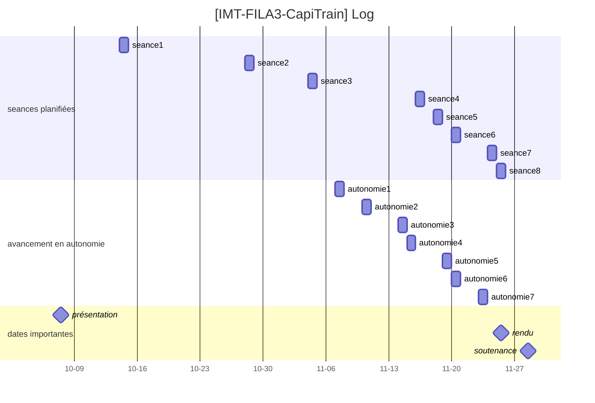

Programmation en Java d’interprètes pour un sous ensemble de Java 8
===

- Auteurs : JALLAIS Adrien & SIMON Géraud
- Promotion : IMT FIL 2023 - 3ème année
- Date de rendu : 25/11/2022

# Sommmaire

[TOC]

# Introduction

Dans le cadre d'une unité d'ensignement d'initiation à la recherche, Rémi Douence a proposé de s'intéresser à une définition rigoureuse des expressions lambdas intégrées par Java 8, avec le papier suivant : [Property-based Testing for Lambda-Expressions Semantics in Featherweight Java. (S. da Silva Feitosa,2018)](https://doi.org/10.1145/3264637.3264643). Dans cet article, les auteurs formalisent cette nouvelle fonctionnalité en utilisant des interprètes en Haskell, dont le code est accessible au répertoire suivant : [fj-lam](https://github.com/fjpub/fj-lam).

L'objectif de ce projet est de convertir ces interprètes en Java et de démontrer le bon fonctionnement de nos interprètes en Java.

# Description du code

Pour faciliter la compréhension globale du code, un [diagramme de classe a été réalisé](https://github.com/Naedri/java-interpreter/blob/main/diagram/java-interpreter-class-diagram.png) : 

## Comment le code est-il organisé ?

Le code de ce projet est organisé de la manière suivante :

- Les différentes structures de données de `FJParser.hs` ont été répartis dans le package `src.Parser.DefinitionP`, sauf pour `Expr` et `TypeError`.
- Les expressions (`Expr`) ont été regroupées dans le package `src.Parser.ExpressionP` et héritent toutes de la classe abstraire java : `Expr`.
- Les différents types d'erreurs (`TypeError`) ont été regroupées dans le package `src.Parser.TypingErrorP`.
- Le package `src.Utils` contient la classe `FJUtils`, avec les méthodes générales d'évaluation.
- Notre traduction de l'approche V1 ne comprend à l'heure actuelle que la traduction de `FJInterpreter.hs`. Celle-ci est disponible dans le package `src.V1`
  - Remarque : Pour `FJInterpreter.java`, les méthodes `evalPrime()` et `subst()` sont accompagnées de "sous-méthodes" correspondantes au *pattern matching* disponible en Haskell selon les types de paramètres (ex: `eval' ct (CreateObject c p)` est traduit en Java par la méthode `evalPrime()` qui va appeler `evalPrimeAsCreateObject()`).

## Comment le code peut-il être lancé ?

Le code de ce projet peut être exécuté en utilisant la fonction `main` du fichier `./src/main.java`.
Sous Eclipse, ce projet peut être importé après avoir dezippé le dossier obtenu depuis github, puis après avoir réalisé les actions suivantes : `File` > `Import` > `General` > `Import` > `Existing Projects into Workspace` > `Select root directory` en sélectionnant comme racine le contenu du dossier décompressé > `Finish`.

# Résultats

## Quelles méthodes en Haskell, ont été converties en Java ?

| Méthodes                       | Première implémentation | Testée                        |
| ------------------------------ | ----------------------- | ----------------------------- |
| **`FJParser`**                 |                         |                               |
| `T.TClass`                     | :white_check_mark:      | :white_check_mark:            |
| `T.TInterface`                 | :white_check_mark:      | :white_check_mark:            |
| `Class`                        | :white_check_mark:      | :white_check_mark:            |
| `Interface`                    | :white_check_mark:      | :negative_squared_cross_mark: |
| `Method`                       | :white_check_mark:      | :white_check_mark:            |
| `Expr.Var`                     | :white_check_mark:      | :white_check_mark:            |
| `Expr.FieldAccess`             | :white_check_mark:      | :white_check_mark:            |
| `Expr.MethodInvk`              | :white_check_mark:      | :negative_squared_cross_mark: |
| `Expr.CreateObject`            | :white_check_mark:      | :white_check_mark:            |
| `Expr.Cast`                    | :white_check_mark:      | :negative_squared_cross_mark: |
| `Expr.Closure`                 | :white_check_mark:      | :negative_squared_cross_mark: |
| `Type`                         | :white_check_mark:      | :white_check_mark:            |
| `Env`                          | :white_check_mark:      | :negative_squared_cross_mark: |
| `CT`                           | :white_check_mark:      | :white_check_mark:            |
| `TypeError.VariableNotFound`   | :white_check_mark:      | :negative_squared_cross_mark: |
| `TypeError.FieldNotFound`      | :white_check_mark:      | :negative_squared_cross_mark: |
| `TypeError.ClassNotFound`      | :white_check_mark:      | :negative_squared_cross_mark: |
| `TypeError.MethodNotFound`     | :white_check_mark:      | :negative_squared_cross_mark: |
| `TypeError.ParamsTypeMismatch` | :white_check_mark:      | :negative_squared_cross_mark: |
| `TypeError.WrongClosure`       | :white_check_mark:      | :negative_squared_cross_mark: |
| `TypeError.WrongCast`          | :white_check_mark:      | :negative_squared_cross_mark: |
| `TypeError.UnknownError`       | :white_check_mark:      | :negative_squared_cross_mark: |
| **`FJUtils`**                  |                         |                               |
| `subtyping`                    | :white_check_mark:      | :negative_squared_cross_mark: |
| `fields`                       | :white_check_mark:      | :negative_squared_cross_mark: |
| `methods`                      | :white_check_mark:      | :negative_squared_cross_mark: |
| `mbody`                        | :white_check_mark:      | :negative_squared_cross_mark: |
| `isValue`                      | :white_check_mark:      | :negative_squared_cross_mark: |
| **`FJInterpreter`**            |                         |                               |
| `eval'`                        | :white_check_mark:      | :negative_squared_cross_mark: |
| `eval`                         | :white_check_mark:      | :negative_squared_cross_mark: |
| `subst`                        | :white_check_mark:      | :negative_squared_cross_mark: |

Les tests qui ont pu être réalisés se résument à s'assurer que les objets créés par l'instanciation de la classe `C` (correspondant au *type definition*). Ces instanciations ont permis des tester l'ensemble des classes du package `src.Parser.DefintionP`.

## Quelles méthodes en Haskell, reste-il à convertir en Java ?

La partie V2 n'a pas pu être implémentée vers le Java, faute de temps.

|                           |                      |                        |
| ------------------------- | -------------------- | ---------------------- |
| **`FJParser`**            |                      |                        |
| `Constr`                  | `Sign`               |                        |
| `FJUtils`                 |                      |                        |
| `absmethods`              | `mtype`              | `lambdaMark`           |
| `removeRuntimeAnnotation` |                      |                        |
| **`FJTypeChecker`**       |                      |                        |
| `throwError`              | `typeof`             | `methodTyping`         |
| `classTyping`             | `interfaceTyping`    | `ctTyping`             |
| **`FJGenerator`**         |                      |                        |
| `maybeElements`           | `pickVar`            | `genClassName`         |
| `genInstantiableType`     | `genClassType`       | `genInterfaceTypeList` |
| `genVar`                  | `genAttrs`           | `genMethod`            |
| `genSign`                 | `genMethods`         | `genClass`             |
| `genInterface`            | `addClass`           | `addInterface`         |
| `addType`                 | `genClassTable`      | `genCreateObject`      |
| `genFieldAccess`          | `genMethodInvk`      | `genCast`              |
| `genClosure`              | `ccreateobject`      | `cfieldaccess`         |
| `cmethodinvk`             | `cucast`             | `cdcast`               |
| `cscast`                  | `cclosure`           | `genExpr`              |
| `genExpression`           | `instance Arbitrary` |                        |

# Discussion

## Quels sont les points forts et faibles de notre interprète en Java

### Points forts

#### Patron *Singleton* pour la $CT$

Il n'est possible d'instancier qu'une seule fois la classe `CT` (*class table* $CT$) car cette classe a été implémentée en suivant le patron *Singleton*.
En effet, la *class table* sert de "dictionnaire" en recensant toutes les classes et méthodes du programme évalué, et est donc universel au programme et doit, pour des soucis d'homogénéité être unique.

#### *TDeclaration* et *T*

Les types correspondants à des Interfaces (`src.Parser.DefinitionP.I`) ou des Classes (`src.Parser.DefinitionP.C`) étendent tous les deux le type $T$, ce qui permet de prévoir une factorisation de code. Par exemple avec le mot clé `extends` commun aux interfaces et aux classes.
Il est prévu également une autre factorisation de code pour la déclaration du corps des classes et des interfaces qui comportent toutes deux des méthodes.

#### `Set` représentant les séquences

Pour réprésenter des séquences (ex. $\overline{T}$), nous avons utilisés des `TreeSet` pour se protéger des duplications des données, tout en gardant une structure de données itérable.
Cela est particulièrement utile pour les séquences d'interfaces ($\overline{I}$) qui définissent les interfaces implémentées ou étendues. En effet, la duplication de nom d'interfaces dans une même liste d'implémentation en Java n'est pas autorisée. De plus les auteurs utilisant le terme de *sequence* font selon nous référence à la notion d'ensemble qui selon nous est constitué d'éléments uniques.
Nous donnons plus de détails sur ce choix dans la partie *Choix réalisés*.

### Points faibles

Seule l'approche V1 a pu être explorée et traduite dans notre projet, faute de temps.

Par ailleurs, nous n'avons pas pu traduire l'ensemble des méthodes de la V1 vers le Java.

De plus, certaines des méthodes qui ont pu être implémentées n'ont pas pu être toutes testées et optimisées (i.e temps d'exécution et de ressources consommées (nombre d'appels entre les objets, redondances des boucles...)).

## Choix réalisés

Comme le montre les points suivants, plusieurs choix on pu être réalisés lors de l'implémentation des interpréteurs.

- Emballer variables de type String dans des classes (ex. `TypeName` dans la classe `Type`).
- Utilisation de structures de représentation des séquences (ex. `Set` à la place de `List` ou `Array`).

Dans la partie suivante nous discuterons de ce dernier choix.

### Structures de représentation des séquences

Dans l'article les auteurs utilisent des séquences ($\overline{T} \overline{I} \overline{M}$)
Dans l'implémentation, ces séquences ont été stockées dans des structures de données. Dans chaque cas, nous avons d'abord vérifié si l'objet lié allait être modifié ou non, et si nous avions besoins de tableaux, de listes ou de collections.
Ce point du rapport va discuter notre choix entre l'utilisation du type `List` ou du type `Set`.

#### options 1 : utilisation du type `List`

##### Avantages

- limite la possibilité d'un `ArrayOutOfBound`
- facilite le parcours des données
- maintient l'ordre d'insertion

##### Inconvénients

- pas de comparaisons entre les données
- pas de protection contre les doublons (il aurait pu être possible de le faire manuellement en redéfinissant des `equals()` à chaque type d'`Expr`, mais cela aurait été fastidieux et source d'erreurs potentielles)

#### option 2 : utilisation du type `Set`

##### Avantages

- protection contre les doublons
- le type `Set` n'autorise qu'une seule valeur nulle dans la collection. Comme le code (cf. `FJUtils` et `FJInterpreter`) contient déjà des contrôles pour éviter qu'un null soit inséré dans une collection, cette caractéristique de structure donnée était adéquate à notre utilisation

##### Inconvénients

- moins adapté pour les parcours que le type `List`
- nécessite un temps de travail supplémentaire pour la définition de l'implémentation de l'interface `Comparable`

#### Conlusion

Notre première version du projet utilisait des **tableaux** pour les structures de données (ex. en attribut de la classe `Signature.java`, on avait `Field[] params`).
Ce choix avait été pris pour les cas où nous étions sûrs que les données étaient définies, et donc que la taille du tableau serait fixe.

La seconde version du projet utilisait des **listes** (`List` puis `ArrayList`).
L'objectif principal était de limiter la possiblité d'un `ArrayOutOfBound` (dépassement de la taille du tableau quand on le parcourt ou quand on y ajoute un nouvel élément). Ensuite, les listes permettaient une navigation plus simple dans les parcours, comme dans les boucles `for`, avec plus de flexibilité que les tableaux.
Une première implémentation était l'utilisation du type `List<>` dans les signatures des méthodes, puis dans l'implémentation un `ArrayList<>`. Cela offre un code plus sûr et plus adapté aux pratiques professionnelles. Cependant, pour simplifier temporairement le code, nous sommes passés à utiliser `ArrayList<>` à chaque occurence.
Nous avions le choix entre `ArrayList` et `LinkedList` :

- `ArrayList` reproduit une structure sous forme de tableau (basée sur l'index d'un élément) et permet de faciliter les get(), ce qui nous semblait le plus pertinent à cette phase du projet.
- `LinkedList` lie les objets de la liste entre eux, ce qui fait que pour récupérer un élément précis, il faut parcourir chaque élément de la liste pour le trouver. Nous avons conclu que l'`ArrayList` était plus pertinent pour optimiser les accès aux éléments de la liste.

La troisième et actuelle version utilise des **sets** (`TreeSet`).
L'objectif était de protéger nos séquences en évitant d'y insérer des doublons.

- Nous avons fait le choix du format `TreeSet` pour garder en mémoire l'ordre d'insertion des objets, et pouvoir utiliser des index sur la structure de données. Ce cas à notamment était nécessaire lors de l'implémentation de la méthode `eval'` dans le cas des `FieldAcess`, où on utilise `Data.List.findIndex` pour récupérer l'index d'un élément, puis retourner l'élément lié à cet index.

# Rétrospectives

Dans le cas où nous devrions refaire ce projet d'initiation à la recherche, nous aurions demandé quelle était la priorité entre finir la compréhension de l'article ou bien l'implémentation des interprètes en Java.

Dans notre cas, nous avons accordé beaucoup de temps lors de nos premières séances à la lecture de l'article, ce qui nous a empêché de nous intéresser au code en Haskell et de commencer à coder, ce qui pourrait expliquer une v1 non terminé.

Si nous avions à recommencer, nous aurions une courbe d'apprentissage sur la compréhension d'Haskell moins longue.

# Annexes

## [Fichier de notes](https://pad.faire-ecole.org/s/QrN2T4Tq_#)

### Lexique

#### concepts java

- `functional interface` : interface possédant une et une seule méthode abstraite
- `abstract method`: une méthode sans implémentation
- `default method` : une méthode déclarées dans une interface
- $\lambda$`-expression` / $\lambda$`-fonction`: fonction anonyme qui implémente une interface fonctionnelle mais qui est écrit sans type. Une $\lambda$`-expression` ne peut cependant être appelée sans type.
- `Object`: Base class of every class, which has no fields (so the invocations of super have no arguments) and no methods
- `target type` : type d'une $\lambda$`-expression` inféré par le compilateur en fonction du contexte de celle-ci. Ce type est nécessaire pour que la $\lambda$`-expression` puisse être invoquée.

#### concepts logiques

- séquent : conjonction d'hypothèses $\vdash$ disjonction de conclusion
- règles : $\frac{premises}{conclusion}$ de séquent

#### concepts mathématiques

- $\overline{x}$ : liste/séquence possiblement vide de $x$
- $\bullet$ : séquence vide : `[]`
- $\langle \rangle$ : séquence dont l'ordre est à prendre en compte (à la différence d'une liste)
- $\Gamma$ : représente un mapping fini : $\overline{x}:\overline{T}$, reliant les variables $x$ à leur type $T$ => **contexte**/**environnement**
- $CT$ : représente une table qui associe le noms des interfaces ou des classes à leur déclaration ($L$ ou $P$)

#### méthodes

- `mtype` : permet d'obtenir le type d'une méthode m dans une classe C, en renvoiyant une paire de `[liste de B, B]` <=> `liste de paramètre et type`
- `mbody` : permet d'obtenir une paire de `[liste de B, B]` <=> `liste des paramètres, expression`
- $\lambda$`mark` : fonction qui ajoute une définition de `cast` si et seulement si la $\lambda$`-expression` apparaît dans le code source

## [Fichier de log](https://pad.faire-ecole.org/s/suGTsvbBS#)

## [Interprétations du code Haskell](https://github.com/Naedri/java-interpreter/tree/main/fj-lam)

Afin de faciliter l'implémentation de nos interpréteurs en Java, une lecture attentive du code en Haskell écrit par les auteurs ([fj-lam](https://github.com/fjpub/fj-lam)) a été réalisée. Une version commentée de ce code est disponible dans le dossier suivant : [./fj-lam](https://github.com/Naedri/java-interpreter/tree/main/fj-lam).
