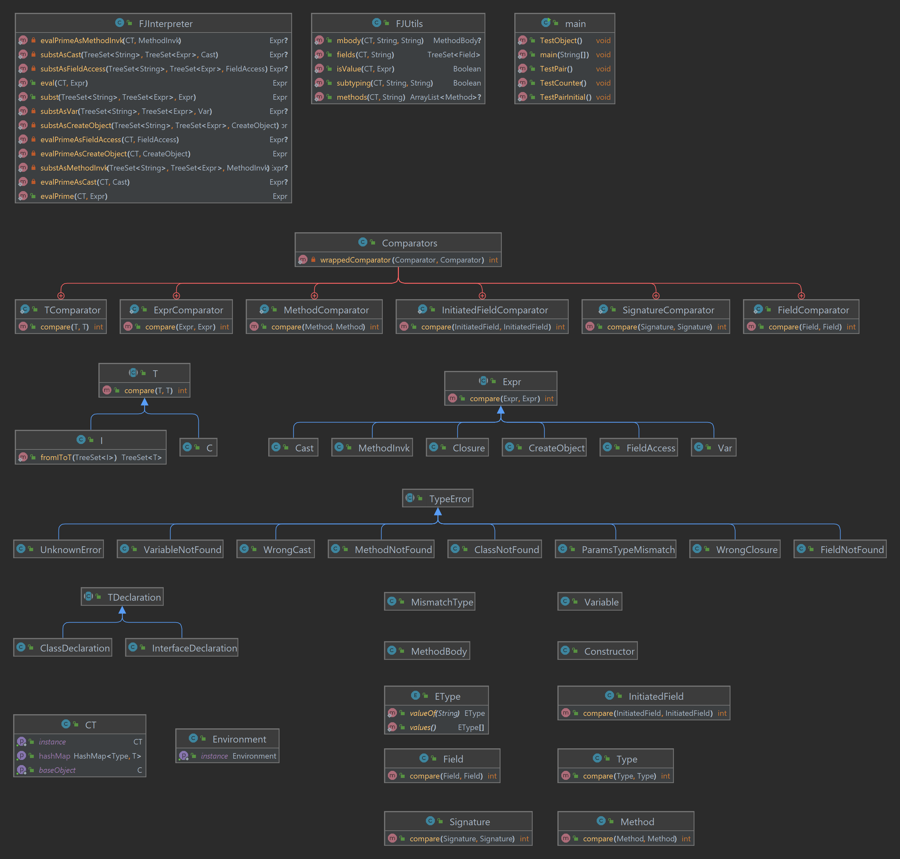

# java-interpreter

## TODO

### doc

- [ ] add authors
- [ ] add ref to paper
- [ ] add objectives from paper
- [ ] add glossary in latex
- [x] add class diagram (and find a way to update it on demand)

### code

- [x] TypeError class
- [x] Expression
- [ ] FJUtils
  - [ ]

#### pour la présentation

- [ ] check that comments are in english
- [ ] determine if we should use alias (e.i. S rather than Signature) => no alias available for java
- [ ] determine if `String name` is it too general ? should we create a EType for methode or class name ?

## Class diagram

